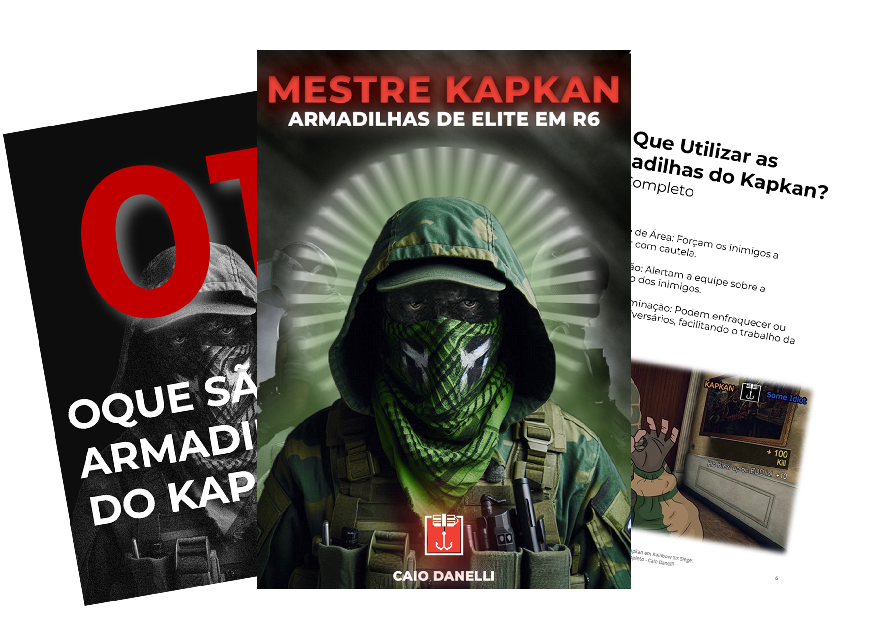

    

-------

# Projeto EBOOK Gerado por I.A.s

 > ℹ️ **NOTE:** Este é o repositório desenvolvido durante o curso no qual fui aluno na plataforma da [DIO](https://dio.me)

Projeto com o objetivo de gerar um ebook digital com as facilidades das ferramentas de IA. todos os prompts
seguem abaixo.

<a href="" title="View PDF now"> 📕Clique aqui para ler</a>

## 💻 Tecnologias utilizadas no projeto

- [ChatGPT](https://chat.openai.com/) 
- [MidJourney](https://www.midjourney.com/app/)
- [PowerPoint](https://www.microsoft.com/en/microsoft-365/powerpoint)
- [Photoshop](https://www.adobe.com/br/products/photoshop.html)

## 🧠 Prompts

ChatGPT：

|   Ação   | prompt                                                                                                                                                                                                                                                                         |
| :------: | ------------------------------------------------------------------------------------------------------------------------------------------------------------------------------------------------------------------------------------------------------------------------------ |
|  título  | Crie um título de um ebook sobre o tema de Como jogar de Kapkan no Rainbow Six Siege, o ebook é do nicho de FPS e o subnicho é o de Games, o titulo deve ser épico e curto, e tenha uma temática de Pro player, me liste 5 variações de título                                                        |
| conteúdo | Faça um texto para ebook , com foco em Armadilhas do Kapkan em Rainbow Six, listando os principais locais para coloca-las com exemplos em imagens, explique sempre de uma maneira simples Deixe o texto enxuto, Sempre traga exemplos de locais em contextos reais , sempre deixe um título sugestivo por tópico |

Midjourney：

|  Ação  | prompt                                                                                 |
| :----: | -------------------------------------------------------------------------------------- |
| título | Kapkan from Rainbow Six Siege with green camouflage clothing, a green hood, and a green fabric mask covering only the mouth and nose --v 5.1 |

## ✨ Features

- Conteúdo gerado via ChatGPT
- Imagens geradas via MidJourney
- Edição das imagens via Photoshop

## 📚 Materiais

- Imagens utilizadas em `assets`
- ebook gerado durante as aulas em `output`

## Autor

    
    
&nbsp&nbsp&nbspCaio Danelli 
    &nbsp&nbsp&nbsp
    <a href="https://github.com/CaioDanelli">
    GitHub</a>&nbsp;|&nbsp;
    <a href="https://www.linkedin.com/in/caio-desenvolvedor-frontend">LinkedIn</a>
&nbsp;|&nbsp;   

  

---